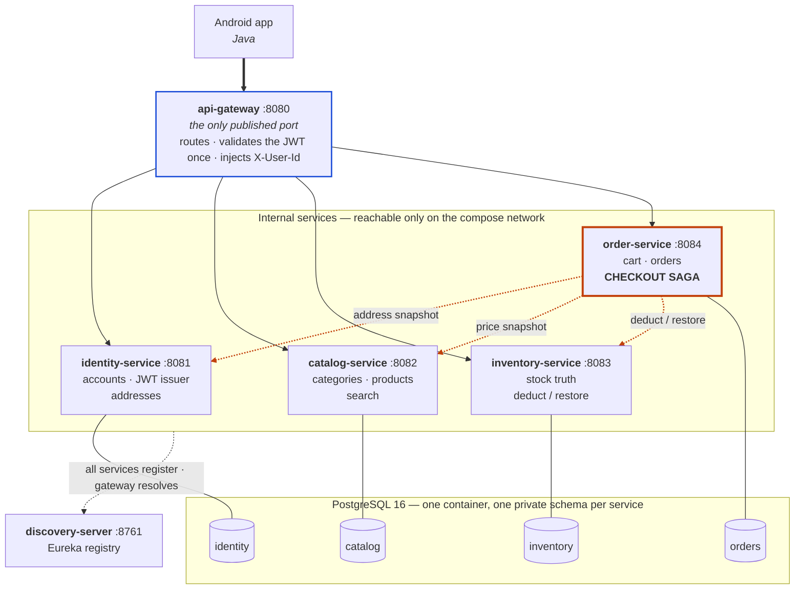

# Techies — E-Commerce Mobile Backend

REST API backing an Android shopping app (Java). University project, Nhóm 3.
Java 21 · Spring Boot 3.5 · Spring Cloud 2025.0 · PostgreSQL 16 · Docker Compose.

There is no admin site by design, so catalog, category and stock data are seeded by migration.

## Architecture



> A PNG of this diagram for slides or a written report is at
> [`docs/images/architecture.png`](docs/images/architecture.png). Regenerate it with
> `./scripts/render-diagrams.sh` after editing the diagram above — the markdown is the source
> of truth and the script extracts from it, so the two cannot drift.

**Black arrows** are client traffic routed by the gateway. **Orange dotted arrows** are the
service-to-service calls that make up the checkout saga — the part of this project that is
actually hard. Plain lines to the cylinders are each service's own database schema.

Three things the diagram is meant to show:

1. **One way in.** Only `api-gateway` publishes a port. Every other service is reachable
   solely on the compose network, which is what makes the `X-User-Id` header it injects safe
   for the other services to trust.
2. **`order` depends on the other three; none of them depend on it.** The dependency arrows
   point one way, so there are no cycles.
3. **No shared database.** One Postgres container, but each service owns a private schema and
   never reads another's. Cross-service data is fetched over HTTP, not by joining tables.

## The problem this project actually solves

Two hard problems, both concentrated in checkout. Everything else is deliberately thin CRUD.

**1. A distributed transaction with compensation.** Checkout spans three services. Stock is
deducted before payment is charged, so when payment fails that deduction must be undone:

```
1. snapshot address     (identity)
2. snapshot prices      (catalog)
3. create order PENDING (local)
4. deduct stock         (inventory)  ──fail──► FAILED(OUT_OF_STOCK), no payment attempted
5. charge payment       (mock)       ──fail──► COMPENSATE: restore stock
                                                FAILED(PAYMENT_FAILED), cart kept
6. order CONFIRMED, cart cleared
```

Every step writes a row to `orders.saga_steps`, so the rollback can be *shown*, not just
claimed. `docs/DEMO.md` §5 walks through it.

**2. Oversell prevention under concurrency.** Two buyers, one unit left. Guarded three ways:
an atomic `UPDATE ... WHERE available >= qty`, `@Version` optimistic locking, and a
`CHECK (available >= 0)` constraint. Proven by a 10-thread test.

## Run it

```bash
cp .env.example .env               # first time only
docker compose up --build -d
docker compose ps                  # wait for all seven containers to report healthy

python3 scripts/demo.py            # full end-to-end walkthrough
./scripts/tunnel.sh                # optional: public HTTPS URL via Cloudflare
```

Only **port 8080** is published. Everything else is reachable solely on the compose network,
which is what makes the gateway's identity injection safe to trust.

After a restart the gateway can answer `503` for 10-20 seconds while it refreshes its Eureka
registry. That is normal; retry rather than debugging it.

## Build and test

```bash
source scripts/env.sh              # REQUIRED — see note below
./mvnw clean install               # build + all 115 tests
./mvnw -pl order-service test      # one module
```

| Module | Tests | Covers |
|---|---:|---|
| `common` | 19 | Error envelope, correlation id filter, problem logging |
| `api-gateway` | 11 | Routing, JWT validation, header-forgery defence |
| `identity-service` | 27 | Register/login/reset, JWT, profile, addresses |
| `catalog-service` | 13 | Categories, search, detail, seeding |
| `inventory-service` | 10 | Deduct, restore, idempotency, **oversell proof** |
| `order-service` | 35 | Cart, **checkout saga**, payment, orders, cancel |

> **`source scripts/env.sh` is not optional on this machine.** An unversioned Homebrew
> `openjdk` (Java 27) shadows the keg-only `openjdk@21`, so plain `mvn` picks the wrong JDK
> and `/usr/libexec/java_home -v 21` also returns the 27 JDK.

> **Docker must be running before you test.** Most tests use Testcontainers for a real
> Postgres. With the daemon down they fail with `Could not find a valid Docker environment`,
> which looks like a code fault but is not one.

## Logging and diagnosing a failure

Every service writes two files to `logs/` on the host (mounted into each container):

```
logs/<service>.log         everything at INFO and above
logs/<service>-error.log   WARN and above only -- read this one first
```

Configured once in `common/src/main/resources/logback-spring.xml`, so all services log
identically. Rolls at 10 MB, gzipped into `logs/archive/`, errors kept 30 days.

**Every failed request is recorded.** `GlobalExceptionHandler` is the single place that logs
problems, so no handler can forget: 5xx at ERROR with a stack trace, 4xx at WARN without one
(a stack trace per declined payment would bury the real faults). Both land in the error file.

Two failure paths sit outside that handler and log themselves:

- The gateway logs `AUTH REJECTED` and `GATEWAY PROBLEM`, which catches problems no service
  sees: an unrouted path (404) and an unreachable service (502).
- A failed checkout answers HTTP **200** with a `FAILED` order, so it never reaches the
  exception handler. `OrderWriter` logs `ORDER FAILED` at WARN instead.

### Tracing one user action across services

Every line carries a correlation id and the caller:

```
2026-09-22 14:24:59 WARN [order-service] [TRACE23f] [8a9118de-...] ... ORDER FAILED ORD-20260922-0001 -> PAYMENT_FAILED
                            ^service        ^request   ^user
```

The gateway mints the id, forwards it as `X-Request-Id`, and echoes it on the response so a
client can quote it. `FeignTracingConfig` carries it onto every service-to-service call, so a
checkout spanning four services stays on one id.

To reconstruct a whole distributed transaction:

```bash
grep -h "<request-id>" logs/*.log | sort          # every service, in time order
grep -rn "API PROBLEM\|API FAILURE" logs/*-error.log | tail -20
grep -rn "ORDER FAILED\|Compensat" logs/order-service*.log
```

You can also pin your own id to make a demo easy to find afterwards:

```bash
curl -H 'X-Request-Id: MYDEMO1' ...
```


## Endpoints

All public paths are prefixed `/api` at the gateway.

| Area | Endpoints |
|---|---|
| Auth (public) | `POST /auth/register` · `/auth/login` · `/auth/check-email` · `/auth/reset-password` |
| User | `GET /users/me` · `GET /users/{id}` · `PUT /users/me` · `PUT /users/me/password` |
| Address | `GET·POST /addresses` · `PUT·DELETE /addresses/{id}` |
| Catalog (public) | `GET /categories` · `GET /products` · `GET /products/{id}` |
| Stock (public) | `GET /stock/{productId}` |
| Cart | `GET /cart` · `POST /cart/items` · `PUT·DELETE /cart/items/{id}` |
| Checkout | `POST /checkout` |
| Orders | `GET /orders` · `GET /orders/{id}` · `POST /orders/{id}/cancel` |

`POST /checkout` returns **200 even when the order fails** — read `order.status`. The mobile
app needs the order id for both the Success and the Payment Result screen.

Not routed by the gateway, and unreachable from the host: `/internal/**` on any service, and
`/stock/deduct` and `/stock/restore`.

## Documentation

| Document | What it covers |
|---|---|
| `docs/CAPABILITY-MAP.md` | Module boundaries, dependency direction, decisions taken |
| `docs/SPEC.md` | Stack, commands, structure, error model, testing bar, boundaries |
| `docs/SPEC-<module>.md` | Per-module contract and acceptance criteria |
| `docs/DEMO.md` | Copy-pasteable walkthrough, including both checkout branches |
| `docs/SEED-IDS.md` | Fixed UUIDs shared by the catalog and stock seed migrations |
| `docs/EXTENSIONS.md` | What was deliberately left out, why, and what adding it would cost |
| `tasks/plan.md`, `tasks/todo.md` | Build plan and task breakdown |
| `logs/` | Runtime log output, gitignored |
| `docs/images/` | PNG exports of the diagrams, for reports and slides |
| `docs/DEPLOY.md` | Deploying to a free Oracle Cloud ARM VM, and why not Render |
| `docs/API.md` | **API reference for the mobile team** — generated from real responses |
| `docs/SECURITY-NOTES.md` | What the deployment does and does not protect against |

## Working in this repo

- The project has its **own** git repo, but sits inside Homebrew's checkout at
  `/opt/homebrew`. A session started here therefore inherits `/opt/homebrew/CLAUDE.md` and
  `AGENTS.md`, which are Homebrew's Ruby rules (`./bin/brew lgtm`, Sorbet, RuboCop) and do
  **not** apply to this Java project. Moving the project outside `/opt/homebrew/var/www`
  would end that.
- Compose keeps its project name (`techies-ecommerce`) in `docker-compose.yml`, so renaming
  the folder does not orphan the containers or volumes.

## Known limitations

All deliberate, all recorded in `docs/EXTENSIONS.md`:

- **Password reset has no ownership proof** — `check-email` then `reset-password` by email
  alone. Chosen for speed; anyone knowing an email can take the account.
- **JWTs cannot be revoked** — 30-day lifetime, no denylist, no logout endpoint. Changing a
  password does not end existing sessions.
- **No reservation lifecycle** — payment is synchronous, so deduct + restore is sufficient.
- **Compensation has no retry queue** — a failed restore is logged to `saga_steps` and must be
  replayed by hand. Inventory's idempotency makes replay safe.
- **Search covers name and description only**, not the category a product belongs to.
- **Orders end at CONFIRMED/FAILED/CANCELLED** — with no admin site, shipping states would be
  unreachable code.
